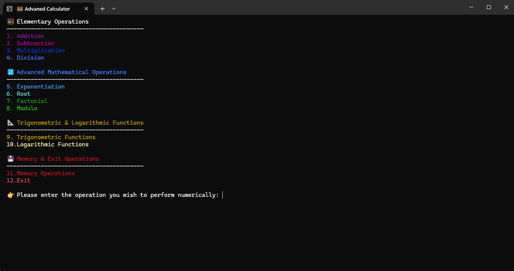
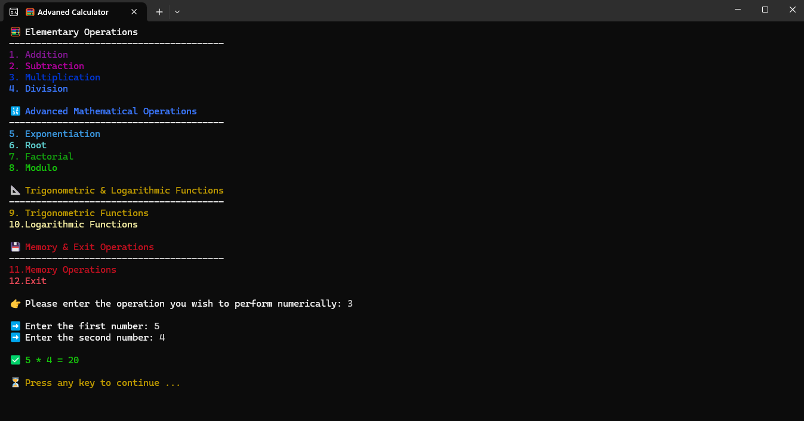
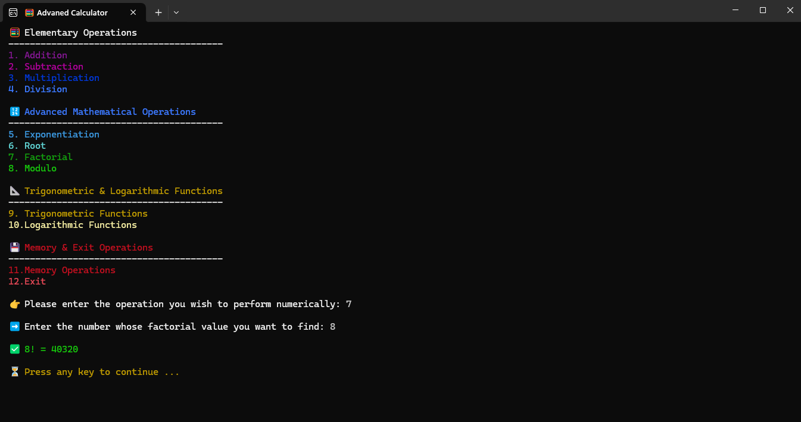
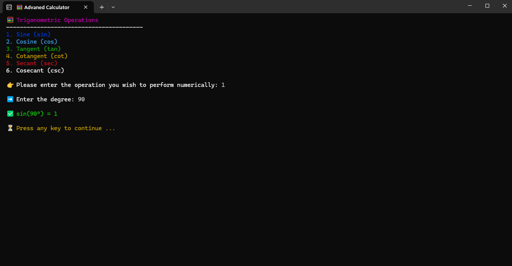
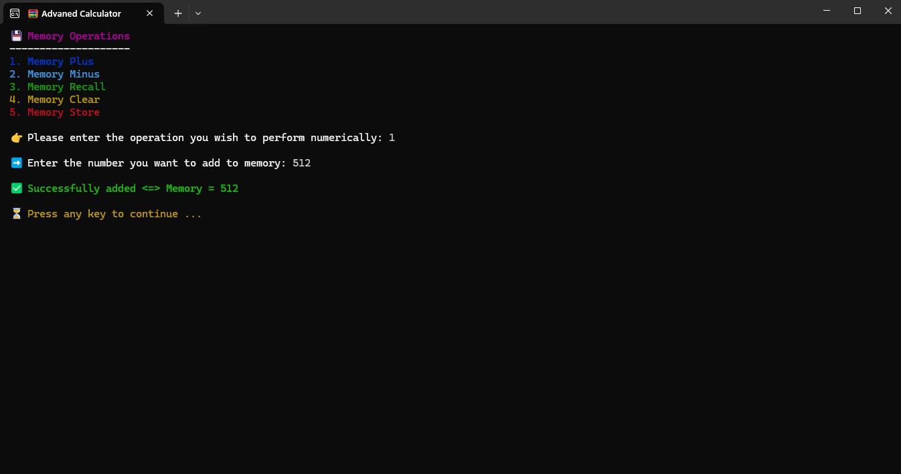

# 🧮 Advanced Calculator - Console Based

<div align="center">


**A colorful and user-friendly console-based calculator capable of performing advanced mathematical operations**

[Features](#-features) • [Installation](#-installation) • [Usage](#-usage) • [Screenshots](#-screenshots) • [License](#-license)

</div>

---

## 📋 About

Advanced Calculator is a comprehensive console-based calculator application developed with .NET 8.0 and C#. It can perform a wide range of mathematical operations from basic arithmetic to trigonometric functions, from logarithmic operations to memory management.

### ✨ Features

- 🎨 **Colorful Console Interface** - Visual appeal with different colors for each operation category
- ➕ **Basic Operations** - Addition, subtraction, multiplication, division
- 🔢 **Advanced Mathematics** - Exponentiation, root, factorial, modulo
- 📐 **Trigonometric Functions** - sin, cos, tan, cot, sec, csc
- 📊 **Logarithmic Operations** - Log₁₀, Natural logarithm, Custom base logarithm
- 💾 **Memory Operations** - Memory store, add, subtract, recall, clear
- ✅ **Error Handling** - Comprehensive error catching and user-friendly messages
- 🔄 **Type-Safe Input** - Safe data input with generic type parameters

---

## 🚀 Installation

### Requirements

- [.NET 8.0 SDK](https://dotnet.microsoft.com/download/dotnet/8.0) or higher

### Steps

1. **Clone the repository**
   ```bash
   git clone https://github.com/Kaaner4mir/advanced-calculator-console-based.git
   cd advanced-calculator-console-based
   ```

2. **Build the project**
   ```bash
   dotnet build
   ```

3. **Run the application**
   ```bash
   dotnet run
   ```

---

## 🎮 Usage

When the application starts, the main menu screen is displayed. You can select the desired operation by entering its number from the menu.

### Main Menu Options

1. **Elementary Operations** (1-4)
   - Addition (+)
   - Subtraction (-)
   - Multiplication (*)
   - Division (/)

2. **Advanced Mathematical Operations** (5-8)
   - Exponentiation (^)
   - Root (√)
   - Factorial (!)
   - Modulo (%)

3. **Trigonometric & Logarithmic Functions** (9-10)
   - Trigonometric Functions
   - Logarithmic Functions

4. **Memory & Exit** (11-12)
   - Memory Operations
   - Exit

### Example Usage

```
👉 Please enter the operation you wish to perform numerically: 1

➡️ Enter the first number: 15
➡️ Enter the second number: 27

✅ 15 + 27 = 42
```

---

## 📸 Screenshots

### Main Menu


### Basic Operations


### Advanced Mathematical Operations


### Trigonometric Functions


### Memory Operations


---

## 📁 Project Structure

```
AdvancedCalculator/
├── Operations/
│   ├── Elementary.cs          # Basic arithmetic operations
│   ├── AdvancedMathematical.cs # Advanced mathematical operations
│   ├── Trigonometry.cs        # Trigonometric functions
│   ├── Logarithm.cs           # Logarithmic operations
│   ├── Memory.cs              # Memory operations
│   └── Exit.cs                # Exit operation
├── Images/                    # Screenshots
├── Menu.cs                    # Menu management
├── Utils.cs                   # Utility functions
├── Initializer.cs             # Main entry point
└── README.md                  # This file
```

---

## 🛠️ Technologies

- **.NET 8.0** - Framework
- **C#** - Programming language
- **Console Application** - Console application

---

## 🤝 Contributing

Contributions are welcome! Please follow these steps:

1. Fork this repository
2. Create a feature branch (`git checkout -b feature/AmazingFeature`)
3. Commit your changes (`git commit -m 'Add some AmazingFeature'`)
4. Push to the branch (`git push origin feature/AmazingFeature`)
5. Open a Pull Request

---

## 📝 License

This project is licensed under the MIT License. See the [LICENSE](LICENSE) file for details.

---

## 👤 Author

**Kaaner4mir**

- GitHub: [@Kaaner4mir](https://github.com/Kaaner4mir)

---

<div align="center">

⭐ If you like this project, don't forget to give it a star!

Made with ❤️ using C# and .NET

</div>

